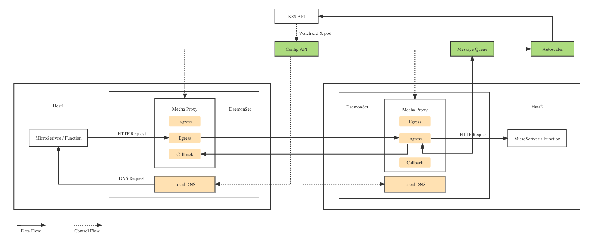

# KindMesh

KindMesh是以DaemonSet的方式实现Service Mesh + Event Mesh功能，为微服务或Serverless函数提供高性能、高可用、高并发的计算框架。

# Feature

- 高性能：DaemonSet的方式实现极致的DNS性能和网络代理能力
- 高可用：在Kubernetes基础上，同时提供服务网格和消息队列的能力，保障节点异常和流量突增场景下的可用性。
- 高并发：Autoscaler实现副本数、request和limit的高效自动调整

## Architecture



## Pre Requirements

- 安装 Kubernetes，本地测试可使用[Kind](https://kind.sigs.k8s.io/)来安装。


- 安装 CRD
```
kubectl apply -f resource/kindmesh_service_crd.yaml
```
- 部署DaemonSet
```
kubectl apply -f resource/daemonset.yaml
```

## Example

```
kubectl apply -f resource/example/bookinfo/rating-services.yaml
```

```
apiVersion: kindmesh.ottstack.dev/v1
kind: Service
metadata:
  name: rating
  namespace: default
spec:
  template:
    spec:
      containers:
      - name: ratings
        image: docker.io/istio/examples-bookinfo-ratings-v1:1.18.0
        imagePullPolicy: IfNotPresent
        ports:
        - containerPort: 9080
        env:
        - name: RATINGS_SERVICE_PORT
          value: "80"
```
以上示例在ott-services定义了raings服务，即可以在集群内通过域名 raings或ratings.(namespace)，或ratings.(namespace).svc.cluster.local来访问对应deployment中的容器。
